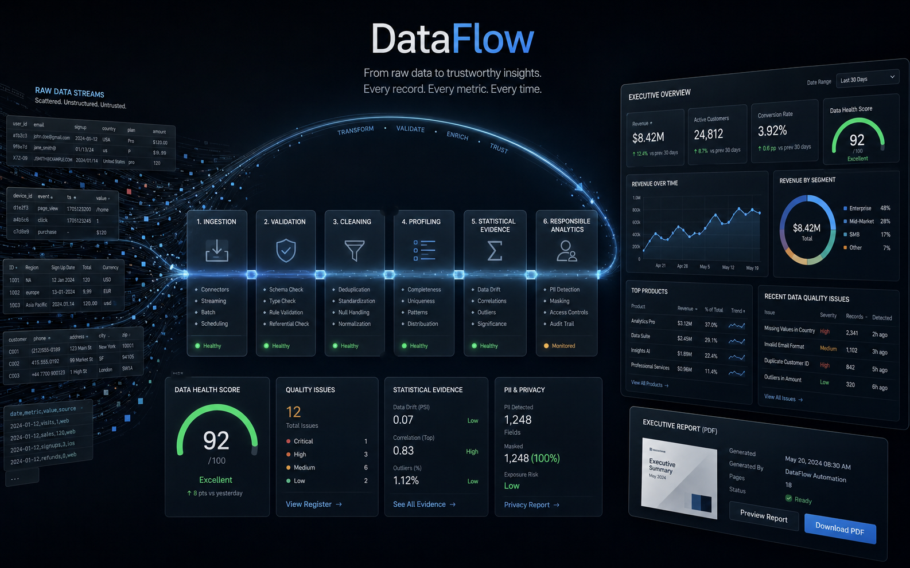
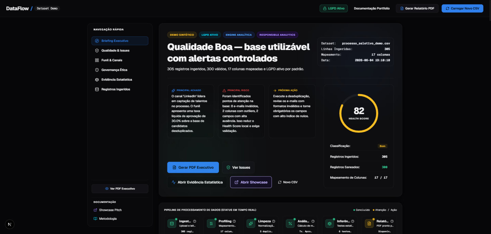
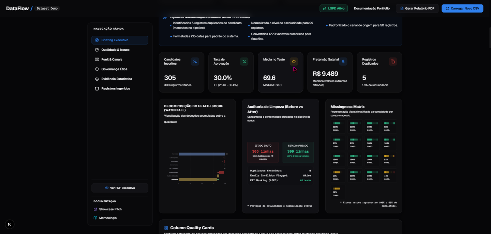
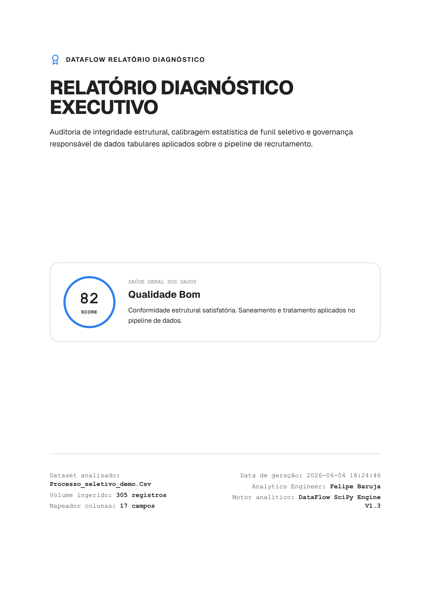
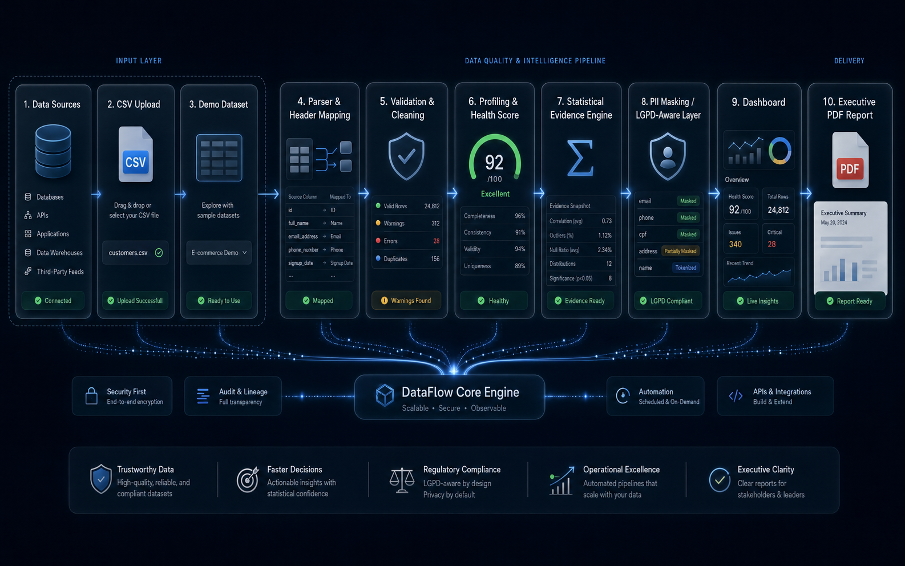

<div align="center">
  

  <h1>DataFlow</h1>

  <p><strong>Profiling, limpeza, evidência estatística e governança responsável para dados tabulares.</strong></p>
  <p><strong>Responsible data profiling, cleaning and statistical evidence for tabular datasets.</strong></p>
</div>

[](https://nextjs.org/)
[](https://www.typescriptlang.org/)
[](https://www.python.org/)
[](https://fastapi.tiangolo.com/)
[](https://scipy.org/)
[](https://tailwindcss.com/)
[](https://www.planalto.gov.br/ccivil_03/_ato2015-2018/2018/lei/l13709.htm)

<p align="center">
  
</p>

---

## 1. Visão Geral / Overview

O **DataFlow** é um projeto de portfólio completo para *Analytics Engineering*, *Data Science* e *Data Engineering*. Ele automatiza o ciclo completo de ingestão de dados tabulares (CSV), convertendo planilhas brutas de recrutamento em um diagnóstico executivo confiável, painéis interativos premium e relatórios estruturados em PDF para tomada de decisão fundamentada.

O sistema aborda um problema clássico de mercado: dados que chegam de formulários públicos com cabeçalhos incoerentes, registros duplicados, e-mails inválidos, outliers discrepantes e nulos abundantes. O DataFlow atua como um validador de integridade local-first que normaliza esses dados, executa testes estatísticos inferenciais de processo na API do Python (**SciPy**) e aplica regras rígidas de proteção à privacidade de dados pessoais em conformidade com a **LGPD** (Lei Geral de Proteção de Dados).

---

## ✨ Product Preview

<p align="center">
  
</p>

O DataFlow apresenta uma experiência dark premium focada em diagnóstico executivo: Health Score, alertas controlados, LGPD ativo, recomendações acionáveis e navegação por seções analíticas.

---

## 2. Por que este projeto importa? / Why this project matters

* **Planilhas são a realidade:** A maioria dos processos de negócios consome dados tabulares imperfeitos. Saber higienizar, monitorar a completude e estruturar pipelines locais é uma habilidade fundamental.
* **Estatística sem contexto gera decisões ruins:** O DataFlow não apenas gera estatísticas descritivas básicas, mas calcula hipóteses inferenciais robustas mitigando riscos de falsos positivos (aplicando **Correção de Bonferroni**).
* **IA e Ética de Dados (Responsible Analytics):** Ele foi desenhado sob preceitos rígidos de governança. O DataFlow audita processos e calibragem, **nunca decide ou ranqueia pessoas**. Todas as informações demográficas ou sensíveis são protegidas.
* **Masterpiece de Engenharia:** Ele substitui os tradicionais scripts estáticos de notebooks por uma solução digital real, interativa e completa.

---

## 🧠 O diferencial do DataFlow / What makes DataFlow different

### Português
O DataFlow não é apenas um dashboard. Ele combina qualidade de dados, evidência estatística e governança responsável em uma experiência rastreável.

Ele mostra não apenas o que os dados indicam, mas também:
- quão confiável a base está;
- o que foi limpo ou sinalizado;
- quais problemas merecem ação;
- quais sinais estatísticos são exploratórios;
- onde a interpretação precisa ser limitada;
- como dados pessoais são protegidos.

### English
DataFlow is not just a dashboard. It combines data quality, statistical evidence and responsible analytics into one traceable experience.

It shows not only what the data says, but also:
- how reliable the dataset is;
- what was cleaned or flagged;
- which issues deserve action;
- which statistical signals are exploratory;
- where interpretation must be limited;
- how personal data is protected.

---

## 3. Principais Funcionalidades / Key Features

- **Executive Data Briefing (Hero Premium):** Diagnóstico instantâneo e pontuação de integridade explicável em menos de 5 segundos.
- **Data Quality Score (Health Score):** Pontuação de 0 a 100 com waterfall interativa de penalidades calculadas na API.
- **Before/After Cleaning Audit:** Grade comparativa mostrando o saneamento estrutural de volumes, nulos, e-mails e categorias.
- **Modo Raw vs Cleaned na Tabela:** Tabela de auditoria interativa baseada em TanStack Table v8, permitindo alternar visualmente entre dados saneados e brutos com tooltips descritivos das transformações de limpeza aplicadas.
- **Context Drawer por Coluna:** Clique nos cabeçalhos da tabela para abrir um drawer lateral com metadados semânticos, tipo inferido, taxas de completude, distribuição local, impactos no Health Score e ações de engenharia recomendadas.
- **Funil Operacional SVG Customizado:** Gráfico de funil proporcional ao volume absoluto com taxas de drop-off e nota metodológica integrada.
- **Matriz de Correlação Spearman 4x4:** Mapa de calor interativo que calcula coeficientes ordinais de Spearman client-side, sendo robusto contra outliers.
- **Outlier Boxplot (IQR):** Visualizador estatístico de quartis e outliers (expectativa salarial, anos de experiência) baseado na regra de amplitude interquartil.
- **Statistical Evidence Center:** Hypothesis testing (Welch t-test, ANOVA de uma via, Qui-Quadrado de Pearson) interpretados em linguagem executiva com badges de múltiplas comparações (Bonferroni) e alertas de falso positivo dinâmicos.
- **Relatório PDF Executivo de 9 Páginas:** Design para impressão A4 que suprime localhost e URLs de navegador via regras `@page` e divide perfeitamente o relatório em seções executivas contendo todos os gráficos e o dicionário de 17 colunas.

---

## 📸 Screenshots

<table>
  <tr>
    <td width="50%">
      
      <br />
      <sub><strong>Data Quality Cockpit</strong> — Health Score, missingness matrix, KPIs and explainable data quality.</sub>
    </td>
    <td width="50%">
      
      <br />
      <sub><strong>Quality Issues Register</strong> — prioritized issues with severity, impact and recommended action.</sub>
    </td>
  </tr>
  <tr>
    <td width="50%">
      
      <br />
      <sub><strong>Funnel & Channels</strong> — operational funnel, source efficiency, time series and score distribution.</sub>
    </td>
    <td width="50%">
      
      <br />
      <sub><strong>Statistical Evidence</strong> — p-values, effect sizes, Bonferroni-aware conclusions and responsible interpretation.</sub>
    </td>
  </tr>
  <tr>
    <td width="50%">
      
      <br />
      <sub><strong>Responsible Analytics</strong> — permitted uses, prohibited uses, sensitive columns and LGPD-aware governance.</sub>
    </td>
    <td width="50%">
      
      <br />
      <sub><strong>Records & Auditability</strong> — masked records, filters, exports and inspection-ready audit table.</sub>
    </td>
  </tr>
</table>

---

## 📄 Executive Report

<p align="center">
  
</p>

O relatório executivo consolida Health Score, KPIs, auditoria de limpeza, evidência estatística, Responsible Analytics, metodologia e dicionário de dados em um artefato pronto para apresentação.

---

## 📌 Estudo de Caso / Case Study

### 📌 Estudo de Caso: Pipeline Sintético de Recrutamento
O dataset demo simula um pipeline de recrutamento com 305 registros ingeridos, 300 registros válidos após limpeza e 17 colunas mapeadas. O DataFlow faz profiling da base, sinaliza e-mails inválidos, identifica duplicatas e outliers, aplica mascaramento de PII e calcula um Health Score explicável.

A camada estatística avalia sinais exploratórios usando testes de Welch, qui-quadrado, ANOVA, tamanhos de efeito e interpretação com correção de Bonferroni. Os resultados são apresentados como evidência de processo, nunca como decisão individual automatizada.

### 📌 Case Study: Synthetic Recruitment Pipeline
The demo dataset simulates a recruitment pipeline with 305 ingested records, 300 valid records after cleaning and 17 mapped columns. DataFlow profiles the dataset, flags invalid emails, identifies duplicates and outliers, applies PII masking and computes an explainable Health Score.

The statistical layer evaluates exploratory signals using Welch t-tests, chi-square tests, ANOVA, effect sizes and Bonferroni-aware interpretation. Results are presented as process-level evidence, never as automated individual decisions.

---

## 4. Arquitetura do Projeto / Project Architecture

O projeto adota uma arquitetura monorepo simplificada e desacoplada:

```text
DataFlow/
├── apps/
│   ├── web/                         # Frontend em Next.js 15 (App Router)
│   │   ├── app/                     # Rotas e páginas (/demo, /showcase, /methodology)
│   │   ├── components/              # Componentes de interface do painel e PDF
│   │   │   ├── charts/              # Funil SVG, Correlação, Boxplot, Waterfall
│   │   │   ├── dashboard/           # Heros, KPICards, Sidebar, Responsible Analytics
│   │   │   ├── report/              # ReportView (Impressão do PDF)
│   │   │   └── table/               # DataTable (Grade interativa + Drawer)
│   │   └── lib/                     # Utilitários (masking, conclusions, api)
│   └── api/                         # Backend em FastAPI/Python 3.12
│       ├── app/                     # Código fonte da API REST
│       │   ├── api/                 # Endpoints (/health, /demo, /analyze)
│       │   ├── models/              # Modelos de validação Pydantic
│       │   └── services/            # Engine de processamento (profiler, cleaner, inference)
│       └── tests/                   # Testes unitários baseados em pytest
├── data/
│   └── seed/                        # Base sintética (processo_seletivo_demo.csv)
├── docs/                            # Documentação técnica e de portfólio
├── assets/
│   └── screenshots/                 # Imagens ilustrativas do produto
├── start.bat                        # Script de inicialização integrada Windows
└── README.md                        # Esta documentação
```

---

## 🧱 Visual Architecture

<p align="center">
  
</p>

DataFlow follows a traceable analytical flow: raw CSV or demo dataset enters the pipeline, gets parsed, validated, cleaned, profiled, scored, interpreted and exported as dashboard insights or executive reports.

---

## 5. Pipeline de Dados / Data Pipeline

```text
CSV Upload / Demo
  ➜ Parser de Encodings e Delimitadores
  ➜ Wizard de Mapeamento de Cabeçalhos
  ➜ Normalização Casing & Formatos de Data
  ➜ Exclusão de Duplicados & Outliers (Cleaning)
  ➜ Profiling de Completude & Health Scoring
  ➜ Testes Estatísticos Inferidos (SciPy)
  ➜ Mascaramento Ativo de PII (LGPD)
  ➜ Apresentação (Dashboard & PDF de 9 Páginas)
```

---

## 6. Primeiros Passos / Getting Started

### Pré-requisitos
- **Node.js** v20 ou superior.
- **Python** 3.10 ou superior (preferencialmente Python 3.12).

### Execução Integrada (Windows)
Se você estiver no Windows, basta dar dois cliques no arquivo `start.bat` na raiz do projeto. Ele inicializará automaticamente o ambiente virtual Python, instalará as dependências do backend, rodará o frontend e abrirá a aplicação em seu navegador padrão.

---

### Execução Manual por Componente

#### 1. Backend FastAPI (`apps/api`)
1. Acesse o diretório:
   ```bash
   cd apps/api
   ```
2. Crie e ative o ambiente virtual:
   ```bash
   python -m venv .venv
   .venv\Scripts\activate   # Windows
   source .venv/bin/activate # Linux/macOS
   ```
3. Instale as dependências:
   ```bash
   pip install -r requirements.txt
   ```
4. Inicie o servidor:
   ```bash
   uvicorn app.main:app --reload --port 8000
   ```
   *O backend FastAPI estará ativo em [http://127.0.0.1:8000](http://127.0.0.1:8000). A documentação interativa fica em `/docs`.*

#### 2. Frontend Next.js (`apps/web`)
1. Acesse o diretório em um novo terminal:
   ```bash
   cd apps/web
   ```
2. Instale as dependências:
   ```bash
   npm install
   ```
3. Inicie o servidor em desenvolvimento com Turbopack:
   ```bash
   npm run dev
   ```
   *O frontend estará disponível em [http://localhost:3000](http://localhost:3000).*

---

## 7. Scripts e Testes / Scripts and Testing

### Rodar Testes de Backend (FastAPI/Pytest)
A API conta com testes unitários para validar a lógica analítica do pipeline.
```bash
cd apps/api
.venv\Scripts\python -m pytest
```

### Validações de Frontend (Next.js)
```bash
cd apps/web
npm run lint         # Verificação de linter (0 avisos tolerados)
npm run typecheck    # Verificação estrita de tipos
npm run build        # Compilação estática de produção
```

---

## 8. Responsible Analytics & Diretrizes LGPD

O DataFlow foi desenhado com foco em **Ética de Dados**:
* **Mascaramento Nativo:** Os nomes e e-mails são anonimizados do lado do cliente (Nome &rarr; Candidato CANXXXX | E-mail &rarr; f***@example.com).
* **Auditoria de Processos:** Os testes estatísticos não determinam aprovação individual, mas validam se o processo global apresenta vieses estatísticos sistêmicos.
* **Veto a Decisões Automatizadas:** É vedado o uso deste sistema para ranqueamento direto ou descarte automático de candidatos com base em scores estatísticos. A decisão humana estruturada é obrigatória.

---

## 9. Metodologia Estatística

- **Welch t-test:** Avaliação de diferenças de médias em testes práticos, adequado para variâncias populacionais e tamanhos amostrais distintos.
- **Chi-Square Association:** Teste qui-quadrado de independência para avaliar associação categórica de escolaridade versus status de aprovação.
- **ANOVA de Uma Via:** Compara médias de notas entre múltiplos grupos (cargos, escolaridade) para avaliar dispersões.
- **Bonferroni Correction:** Dividimos $\alpha = 0.05$ por 6 comparações ($\alpha_{adj} \approx 0.0083$) para anular a inflação de erros do Tipo I ao rodar múltiplos testes.
- **outlier IQR limits:** Quartis calculados localmente. Valores discrepantes sofrem penalizações no Health Score e são sinalizados.

---

## 10. Documentação de Portfólio Complementar

* [Portfolio Pitch (docs/portfolio_pitch.md)](file:///C:/dev/DataFlow/docs/portfolio_pitch.md): Roteiros de apresentação de 30s, 60s, LinkedIn posts e respostas para perguntas difíceis em entrevistas.
* [Final Release Audit (docs/final_release_audit.md)](file:///C:/dev/DataFlow/docs/final_release_audit.md): Auditoria técnica completa de stack, regras de score e release.
* [Upgrade Summary V2 (docs/upgrade_summary_v2.md)](file:///C:/dev/DataFlow/docs/upgrade_summary_v2.md): Registro das evoluções da versão V1.3.

---

## 🖼️ GitHub Social Preview

A social preview image is available at:
```txt
assets/social-preview.png
```
Recommended usage: GitHub repository settings → Social preview → Upload `assets/social-preview.png`.

---

## 🔖 GitHub Repository Metadata

Suggested description:
```txt
Responsible data profiling, cleaning, statistical evidence and LGPD-aware analytics for tabular datasets.
```

Suggested topics:
```txt
data-quality
analytics-engineering
data-profiling
statistics
fastapi
nextjs
typescript
python
scipy
responsible-ai
lgpd
dashboard
portfolio-project
data-visualization
csv-processing
```

---

## 🤝 Créditos

Este projeto foi construído por **Felipe Alirio Baruja** como projeto de portfólio profissional âncora, combinando engenharia de software full-stack e ciência de dados responsável.
* GitHub: [BarujaFe1](https://github.com/BarujaFe1)
* Repositório Oficial: [DataFlow](https://github.com/BarujaFe1/DataFlow)
* E-mail: felipe.baruja@example.com (sintético/portfólio)

MIT License. Copyright (c) 2026 Felipe Alirio Baruja.
