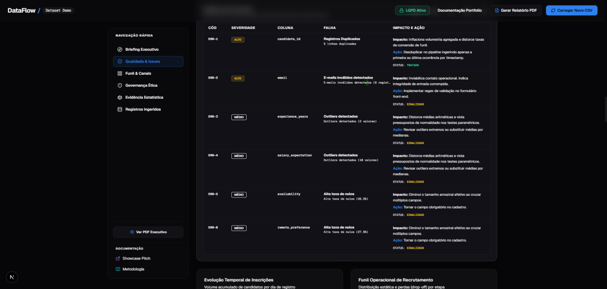
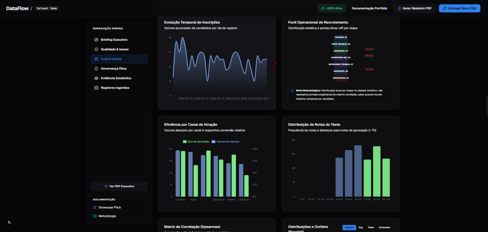
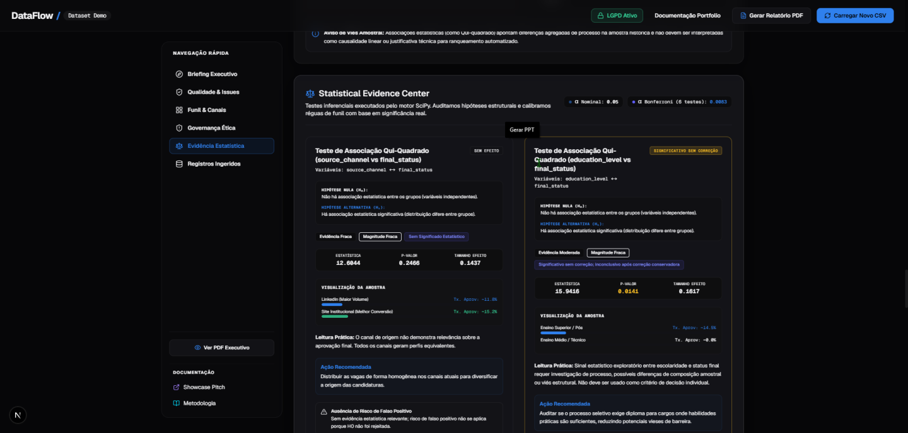
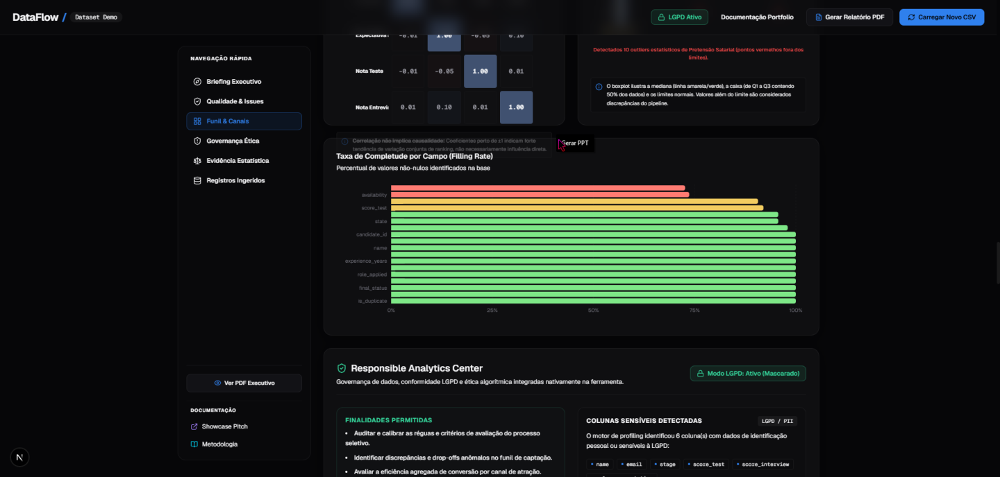
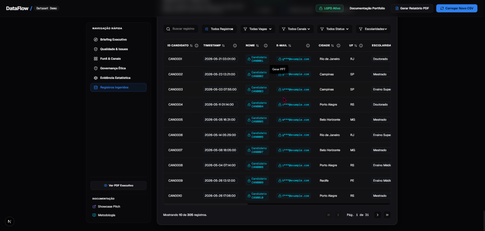

<div align="center">
  

  <h1>DataFlow</h1>

  <p><strong>Profiling, limpeza, evidência estatística e governança responsável para dados tabulares.</strong></p>
  <p><strong>Responsible data profiling, cleaning and statistical evidence for tabular datasets.</strong></p>

  <p>
    <a href="#-visão-geral">PT-BR</a> •
    <a href="#-overview">English</a> •
    <a href="#-product-preview">Preview</a> •
    <a href="#-stack--tecnologias">Stack</a> •
    <a href="#-arquitetura--architecture">Architecture</a> •
    <a href="#-quick-start--início-rápido">Quick Start</a> •
    <a href="#-autor--author">Author</a>
  </p>

  <p>
    
    
    
    
    
    
  </p>
</div>

---

<!--
Imagem recomendada para o GitHub Social Preview:
assets/social-preview.png
Tamanho ideal: 1280x640, menos de 1MB.

Antes de publicar o README no GitHub, adicione as imagens abaixo no repositório:

assets/
├── icon.png
├── social-preview.png
└── screenshots/
    ├── 01-executive-briefing.png
    ├── 02-data-quality-cockpit.png
    ├── 03-quality-issues-register.png
    ├── 04-funnel-and-channels.png
    ├── 05-statistical-evidence.png
    ├── 06-responsible-analytics.png
    ├── 07-records-auditability-table.png
    └── 08-executive-pdf-report.png

Se as imagens ainda não estiverem no repositório, comente temporariamente a seção "Product Preview"
para evitar links quebrados.
-->

## ✨ Product Preview

<p align="center">
  
</p>

<div align="center">
  <p><strong>Executive Data Briefing</strong> — Health Score, LGPD-aware badges, synthetic demo status and action-oriented recommendations.</p>
</div>

---

## 🇧🇷 Visão geral

O **DataFlow** é um produto de dados criado para transformar bases tabulares imperfeitas em um diagnóstico executivo confiável.

Ele automatiza um fluxo completo de **ingestão, validação, limpeza, profiling, pontuação de qualidade, análise estatística, mascaramento de dados sensíveis e geração de relatório executivo**. Em vez de tratar arquivos CSV como planilhas isoladas, o DataFlow os converte em um pipeline analítico rastreável, com evidências, limitações e recomendações.

O projeto foi desenvolvido por **Felipe Alirio Baruja** como uma peça âncora de portfólio, combinando:

- engenharia de dados aplicada;
- analytics engineering;
- estatística inferencial;
- UX para produtos de dados;
- visualização analítica;
- governança e uso responsável de dados;
- dashboard executivo;
- relatório PDF;
- documentação técnica e narrativa de produto.

> **Responsible Analytics Notice**  
> O DataFlow foi criado para diagnóstico agregado, auditoria de qualidade e análise de processo. Ele **não deve** ser usado para ranquear, aprovar, reprovar ou tomar decisões automatizadas sobre indivíduos.

---

## 🧠 O diferencial do DataFlow

O DataFlow não é apenas um dashboard. Ele combina **qualidade de dados**, **evidência estatística** e **governança responsável** em uma experiência rastreável.

Ele mostra não apenas o que os dados indicam, mas também:

- quão confiável a base está;
- o que foi limpo, removido ou sinalizado;
- quais problemas merecem ação;
- quais sinais estatísticos são apenas exploratórios;
- onde a interpretação precisa ser limitada;
- como dados pessoais são protegidos;
- quais recomendações são executivas, técnicas ou de governança.

---

## 🎯 Problema que resolve

Em fluxos reais de negócio, bases tabulares costumam chegar com problemas como:

- cabeçalhos inconsistentes;
- registros duplicados;
- e-mails inválidos;
- campos ausentes;
- valores discrepantes;
- datas e categorias em formatos diferentes;
- baixa rastreabilidade do que foi limpo ou alterado;
- dificuldade para transformar dado bruto em análise confiável;
- relatórios que exibem números sem explicar incertezas;
- risco de uso indevido de dados pessoais ou sensíveis.

O **DataFlow** cria uma camada organizada entre o dado bruto e a decisão analítica.

---

## 🧩 Proposta

O DataFlow processa dados tabulares e entrega uma visão estruturada da qualidade da base, dos principais problemas, dos sinais estatísticos e dos limites de interpretação.

```txt
CSV Upload / Demo Dataset
  ↓
Parsing e mapeamento de colunas
  ↓
Validação de estrutura e tipos
  ↓
Limpeza, normalização e padronização
  ↓
Profiling de completude, duplicidade e outliers
  ↓
Health Score explicável
  ↓
Evidência estatística inferencial
  ↓
Mascaramento LGPD / PII
  ↓
Dashboard executivo
  ↓
Relatório PDF
```

---

## 📌 Case Study: Synthetic Recruitment Pipeline

A demo atual simula um pipeline de recrutamento com:

- **305 registros ingeridos**;
- **300 registros válidos após limpeza**;
- **17 colunas mapeadas**;
- **Health Score 82/100**;
- **taxa de aprovação de 30%**;
- **5 duplicidades tratadas**;
- e-mails inválidos sinalizados;
- outliers identificados;
- dados pessoais mascarados por padrão;
- evidência estatística interpretada com cautela.

A camada estatística avalia sinais exploratórios com **Welch t-test**, **qui-quadrado**, **ANOVA**, **tamanhos de efeito**, **correlação de Spearman** e interpretação sensível a **múltiplas comparações**.

Os resultados são apresentados como evidência de processo, não como regra de decisão individual.

---

## 📸 Screenshots

<table>
  <tr>
    <td width="50%">
      
      <br />
      <sub><strong>Data Quality Cockpit</strong> — Health Score, waterfall, missingness, KPIs and column-level profiling.</sub>
    </td>
    <td width="50%">
      
      <br />
      <sub><strong>Quality Issues Register</strong> — prioritized issues with severity, impact and recommended action.</sub>
    </td>
  </tr>
  <tr>
    <td width="50%">
      
      <br />
      <sub><strong>Funnel & Channels</strong> — operational funnel, source efficiency and score distribution.</sub>
    </td>
    <td width="50%">
      
      <br />
      <sub><strong>Statistical Evidence</strong> — p-values, effect sizes, Bonferroni-aware interpretation and recommended actions.</sub>
    </td>
  </tr>
  <tr>
    <td width="50%">
      
      <br />
      <sub><strong>Responsible Analytics</strong> — LGPD-aware masking, prohibited uses and human review constraints.</sub>
    </td>
    <td width="50%">
      
      <br />
      <sub><strong>Records & Auditability</strong> — masked records, filters, exports and inspection-ready table.</sub>
    </td>
  </tr>
</table>

---

## 📄 Executive Report

<p align="center">
  
</p>

O DataFlow também gera um relatório executivo em PDF com:

- capa;
- sumário executivo;
- KPIs;
- Health Score;
- auditoria de limpeza;
- evidência estatística;
- governança e Responsible Analytics;
- dicionário de dados;
- metodologia;
- limitações.

---

## 🧭 Visual Story

A experiência do DataFlow foi pensada como uma jornada analítica:

```txt
1. Abrir a demo
2. Ler o briefing executivo
3. Inspecionar o Health Score
4. Revisar problemas de qualidade
5. Explorar funil e canais
6. Conferir evidência estatística
7. Validar Responsible Analytics
8. Auditar registros mascarados
9. Exportar o relatório executivo
```

---

## ⚙️ Funcionalidades principais

### Executive Data Briefing

Um painel inicial para leitura rápida do dataset:

- Health Score;
- volume ingerido;
- registros válidos;
- colunas mapeadas;
- status geral da base;
- badges de demo, LGPD, engine analítica e Responsible Analytics;
- CTAs para relatório, issues, evidência estatística e upload de novo CSV.

### Data Quality Score

Pontuação de qualidade dos dados com cálculo explicável.

O score parte de uma referência base e aplica penalidades por:

- nulos relevantes;
- duplicatas;
- e-mails inválidos;
- outliers;
- colunas vazias;
- colunas constantes;
- inconsistências estruturais.

### Health Score Waterfall

Visualização do caminho da pontuação:

```txt
100 pontos
  ↓ - campos ausentes
  ↓ - duplicidades
  ↓ - e-mails inválidos
  ↓ - outliers
  ↓
Score final
```

Essa abordagem transforma uma nota abstrata em um diagnóstico rastreável.

### Quality Issues Register

Registro estruturado de problemas encontrados na base.

Cada issue pode conter:

- código;
- severidade;
- coluna afetada;
- tipo de falha;
- impacto analítico;
- ação recomendada;
- status de tratamento.

### Before/After Cleaning Audit

Auditoria de limpeza comparando o estado bruto e o estado tratado da base:

- registros ingeridos;
- registros válidos;
- duplicatas removidas;
- e-mails inválidos sinalizados;
- outliers identificados;
- mascaramento de PII aplicado.

### LGPD / PII Masking

O DataFlow possui preocupação explícita com privacidade.

Exemplo:

```txt
Nome original: Gustavo Pereira
Nome exibido: Candidato CAN0001

E-mail original: gustavo.pereira@example.com
E-mail exibido: g***@example.com
```

O objetivo é permitir análise e auditoria sem expor dados pessoais desnecessariamente.

### Responsible Analytics Center

Seção dedicada a uso responsável.

#### Uso permitido

- auditoria agregada;
- qualidade de dados;
- análise de processo;
- identificação de problemas estruturais;
- apoio à decisão humana.

#### Uso proibido

- ranquear candidatos automaticamente;
- aprovar ou reprovar indivíduos de forma automatizada;
- usar escolaridade, salário, nota ou canal como critério determinístico;
- substituir revisão humana;
- exportar dados pessoais sem mascaramento.

### Statistical Evidence Center

Centro de evidência estatística com testes inferenciais e interpretação executiva.

Inclui:

- Welch t-test;
- qui-quadrado de Pearson;
- ANOVA de uma via;
- tamanhos de efeito;
- alerta de múltiplas comparações;
- correção de Bonferroni;
- leitura prática;
- ações recomendadas;
- limites de interpretação.

O foco não é apenas calcular p-valores, mas explicar o que os resultados significam e o que **não** devem significar.

### Spearman Correlation Matrix

Matriz de correlação ordinal para variáveis numéricas, com alerta metodológico:

> Correlação não implica causalidade.

### Boxplot Outlier Detection

Visualização de outliers com base em IQR para variáveis numéricas como:

- expectativa salarial;
- anos de experiência;
- nota de teste;
- nota de entrevista.

### Operational Funnel

Representação do funil operacional do dataset.

O DataFlow diferencia distribuição atual por etapa de jornada longitudinal real, evitando conclusões incorretas sobre conversão quando não há histórico temporal por candidato.

### Records & Auditability Table

Tabela investigativa com:

- busca;
- filtros;
- paginação;
- densidade visual;
- dados mascarados;
- exportação CSV;
- exportação JSON;
- flags de anomalia;
- rastreabilidade dos registros analisados.

---

## 🇺🇸 Overview

**DataFlow** is a data product designed to transform imperfect tabular datasets into a reliable executive diagnostic experience.

It automates a complete flow of **ingestion, validation, cleaning, profiling, quality scoring, statistical evidence, privacy masking and executive reporting**. Instead of treating CSV files as isolated spreadsheets, DataFlow turns them into a traceable analytical pipeline.

This project was built as a portfolio anchor, combining:

- applied data engineering;
- analytics engineering;
- inferential statistics;
- data product UX;
- responsible analytics;
- executive dashboards;
- technical documentation;
- visual product presentation.

> DataFlow is not a candidate ranking or automated decision-making tool.  
> It is designed for aggregated process auditing, data quality and responsible analytics.

---

## 🛠️ Stack / Tecnologias

### Frontend

- Next.js 15
- React
- TypeScript
- Tailwind CSS
- Recharts
- TanStack Table
- Lucide Icons

### Backend

- Python
- FastAPI
- Pydantic
- Pandas
- SciPy
- Pytest

### Data / Analytics

- CSV parsing
- Data profiling
- Cleaning pipeline
- Health Score calculation
- Outlier detection via IQR
- Welch t-test
- Chi-square test
- One-way ANOVA
- Spearman correlation
- Bonferroni-aware conclusions

### Tools

- Monorepo structure
- Windows integrated starter script
- Executive PDF generation
- Technical documentation in `/docs`

---

## 🧱 Arquitetura / Architecture

```txt
DataFlow/
├── apps/
│   ├── web/                         # Frontend Next.js
│   │   ├── app/                     # Routes and pages
│   │   ├── components/              # UI, dashboard, charts, report, table
│   │   ├── lib/                     # API client, masking, insights, analytics helpers
│   │   └── types/                   # TypeScript types
│   │
│   └── api/                         # FastAPI backend
│       ├── app/
│       │   ├── api/                 # Endpoints
│       │   ├── models/              # Pydantic models
│       │   └── services/            # Profiler, cleaner, inference
│       └── tests/                   # Backend tests
│
├── data/
│   └── seed/                        # Synthetic demo dataset
│
├── docs/                            # Technical and portfolio documentation
├── assets/                          # Icons, screenshots and images
├── start.bat                        # Integrated Windows starter
├── README.md
├── prd.md
├── product_roadmap.md
└── design.md
```

---

## 🔁 Data Flow

```txt
Raw Input
  ↓
Encoding / Delimiter Parsing
  ↓
Header Mapping
  ↓
Schema Validation
  ↓
Cleaning
  ↓
Normalization
  ↓
Profiling
  ↓
Quality Scoring
  ↓
Statistical Evidence
  ↓
Responsible Analytics Layer
  ↓
Dashboard / PDF / Exports
```

---

## 🚀 Quick Start / Início rápido

### Pré-requisitos

- Node.js 20+
- Python 3.10+ ou 3.12+
- Git

### Opção 1 — Execução integrada no Windows

Na raiz do projeto:

```bash
start.bat
```

Esse script inicializa o backend e o frontend localmente.

### Opção 2 — Execução manual

#### Backend

```bash
cd apps/api
python -m venv .venv
.venv\Scripts\activate
pip install -r requirements.txt
uvicorn app.main:app --reload --port 8000
```

Backend:

```txt
http://127.0.0.1:8000
```

Documentação da API:

```txt
http://127.0.0.1:8000/docs
```

#### Frontend

Em outro terminal:

```bash
cd apps/web
npm install
npm run dev
```

Frontend:

```txt
http://localhost:3000
```

---

## ⚙️ Configuração

Crie arquivos `.env` apenas se necessário e nunca versione credenciais.

Exemplo:

```env
NEXT_PUBLIC_API_URL=http://127.0.0.1:8000
```

> Ajuste as variáveis conforme a versão local do projeto.

---

## 🧪 Scripts e testes

### Backend

```bash
cd apps/api
.venv\Scripts\python -m pytest
```

### Frontend

```bash
cd apps/web
npm run lint
npm run typecheck
npm run build
```

> Caso algum script não exista na versão local, consulte `package.json` e ajuste esta seção.

---

## 📊 Metodologia estatística

O DataFlow utiliza estatística inferencial como camada de evidência, não como motor de decisão automática.

### Welch t-test

Usado para comparar médias entre grupos quando variâncias e tamanhos amostrais podem diferir.

### Chi-square test

Usado para investigar associação entre variáveis categóricas.

### One-way ANOVA

Usada para comparação de médias entre múltiplos grupos.

### Effect sizes

O projeto diferencia significância estatística de magnitude prática.

### Bonferroni correction

Ao executar múltiplos testes, o DataFlow considera correção conservadora para reduzir risco de falso positivo.

### Spearman correlation

Usada para correlação ordinal em variáveis numéricas, especialmente útil quando há outliers.

### IQR outlier detection

Outliers são sinalizados com base na amplitude interquartil.

---

## 🛡️ Segurança, LGPD e boas práticas

O DataFlow foi desenhado com uma postura **LGPD-aware** e de **Responsible Analytics**.

Boas práticas consideradas:

- mascaramento de nomes e e-mails;
- dados demo sintéticos;
- separação entre análise agregada e decisão individual;
- avisos contra uso discriminatório;
- dicionário de dados;
- rastreabilidade de transformações;
- não versionar `.env`;
- não versionar credenciais;
- não expor dados pessoais em logs;
- validar dados de entrada;
- documentar limitações estatísticas.

---

## 🧭 Roadmap

### Fase 0 — Fundação

- Estrutura monorepo
- Frontend Next.js
- Backend FastAPI
- Dataset demo sintético
- Primeira versão do dashboard

### Fase 1 — Pipeline principal

- Upload CSV
- Parser
- Mapeamento de colunas
- Limpeza inicial
- Profiling
- Health Score

### Fase 2 — Qualidade e validação

- Quality Issues Register
- Missingness Matrix
- Health Score Waterfall
- Before/After Cleaning Audit
- Outlier detection

### Fase 3 — Estatística aplicada

- Welch t-test
- Chi-square
- ANOVA
- Spearman correlation
- Effect sizes
- Bonferroni-aware conclusions

### Fase 4 — Responsible Analytics

- LGPD masking
- Colunas sensíveis
- Uso permitido/proibido
- Alertas éticos
- Diretrizes de governança

### Fase 5 — Interface e visualização

- Dashboard dark premium
- Sidebar de navegação
- Funil operacional
- Boxplots
- Correlação
- Tabela auditável

### Fase 6 — Relatório e portfólio

- PDF executivo
- README profissional
- Documentação técnica
- Showcase
- Assets visuais

### Próximas evoluções

- Virtualização para datasets grandes
- Validação de schema mais rica
- One-page executive report
- Deploy público da demo
- CI/CD
- Mais testes automatizados
- Melhorias de acessibilidade
- Mais componentes de Data UX em nível de célula

---

## 💼 Valor para portfólio

O DataFlow demonstra a capacidade de transformar um problema comum de dados em um produto completo.

Ele evidencia:

- pensamento de produto;
- domínio de dados tabulares;
- engenharia de dados aplicada;
- UX para análise;
- visualização de dados;
- estatística inferencial;
- preocupação ética;
- documentação;
- arquitetura full-stack;
- narrativa executiva;
- capacidade de apresentar um projeto técnico de forma profissional.

Este projeto é especialmente relevante para vagas e contextos de:

- Data Analyst;
- Data Scientist;
- Analytics Engineer;
- Data Engineer;
- BI Developer;
- Product-minded Developer;
- Research/Data Internships;
- projetos de portfólio técnico.

---

## 📚 Documentação complementar

- `docs/portfolio_pitch.md` — pitch de entrevista, LinkedIn e apresentação do projeto.
- `docs/final_release_audit.md` — auditoria técnica da versão final.
- `docs/technical_methodology.md` — metodologia analítica e estatística.
- `docs/release_notes_v1.3.md` — notas de release e evolução do projeto.

---

## 🧩 GitHub repository setup

Sugestão para o campo **About** do GitHub:

```txt
Responsible data profiling, cleaning, statistical evidence and LGPD-aware analytics for tabular datasets.
```

Topics sugeridos:

```txt
data-quality
analytics-engineering
data-profiling
statistics
fastapi
nextjs
typescript
python
scipy
responsible-analytics
lgpd
dashboard
portfolio-project
data-visualization
csv-processing
```

Imagem recomendada para **Social Preview**:

```txt
assets/social-preview.png
1280x640
PNG/JPG
menos de 1MB
```

---

## 👤 Autor / Author

Developed by **Felipe Alirio Baruja**.

- **Portfolio:** [https://barujafe.vercel.app/](https://barujafe.vercel.app/)
- **GitHub:** [github.com/BarujaFe1](https://github.com/BarujaFe1)
- **LinkedIn:** [linkedin.com/in/barujafe](https://www.linkedin.com/in/barujafe/)

---

## 📄 Licença / License

Este projeto está disponível sob licença MIT **se** o arquivo `LICENSE` estiver presente no repositório.

Se ainda não houver arquivo de licença, adicione uma licença antes de publicar oficialmente como open source.

---

<div align="center">
  <p><strong>DataFlow</strong></p>
  <p>Dados dispersos entram. Fluxos claros saem.</p>
  <p><em>Scattered data in. Clear flows out.</em></p>
</div>
