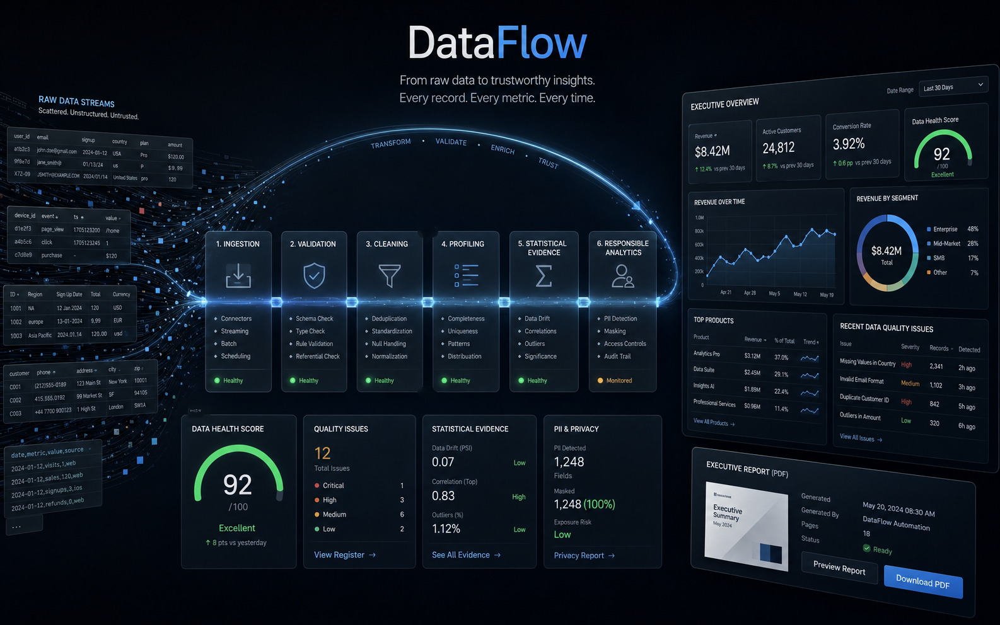
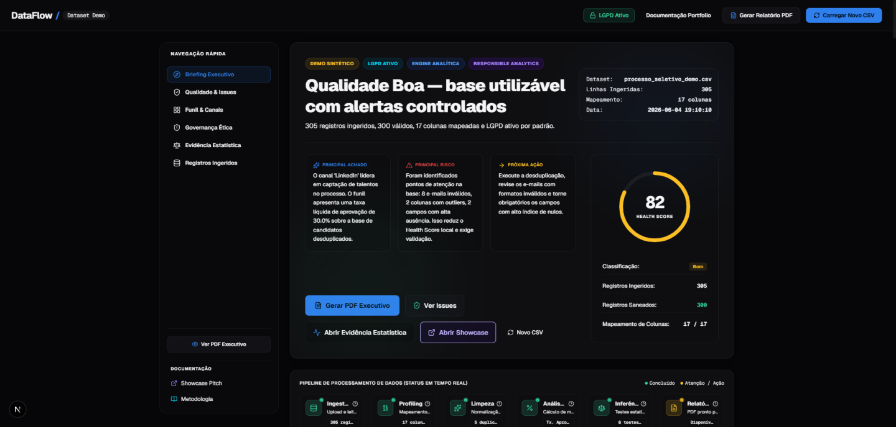
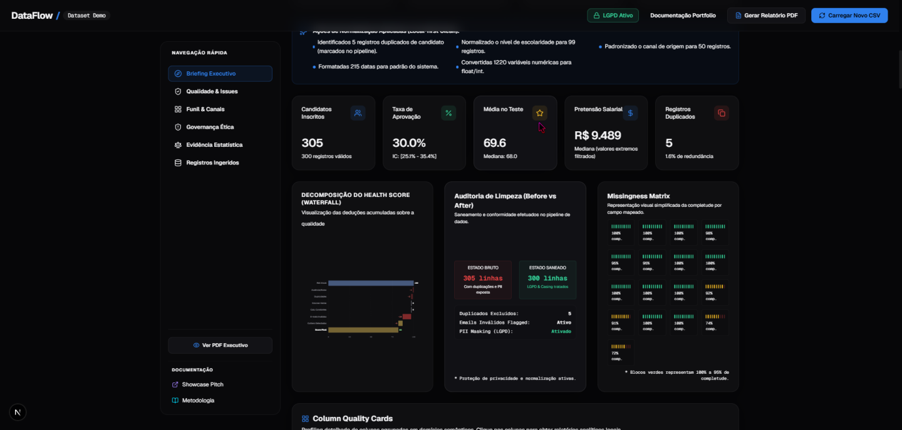
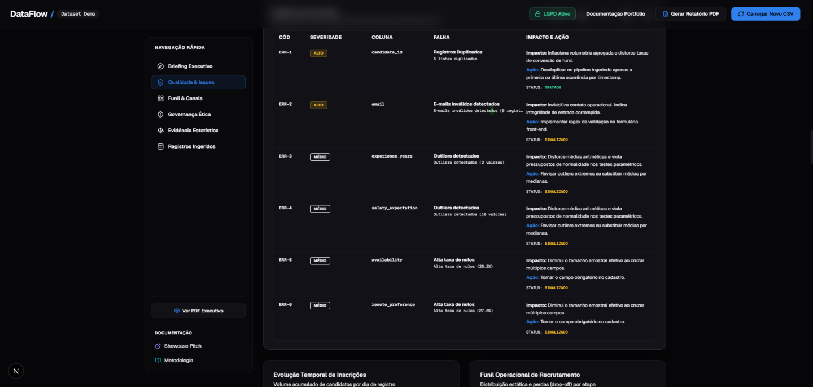
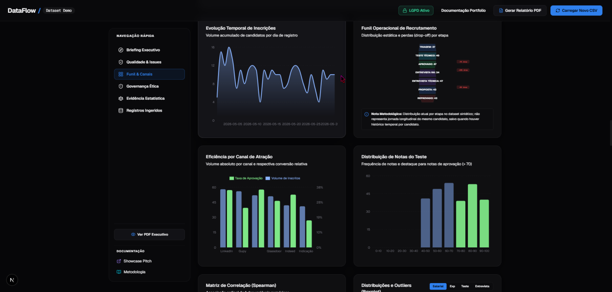
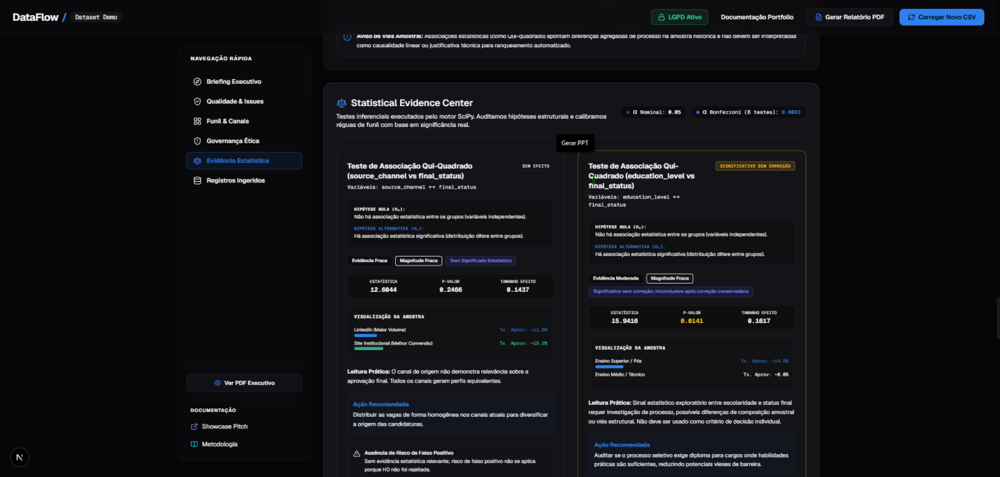
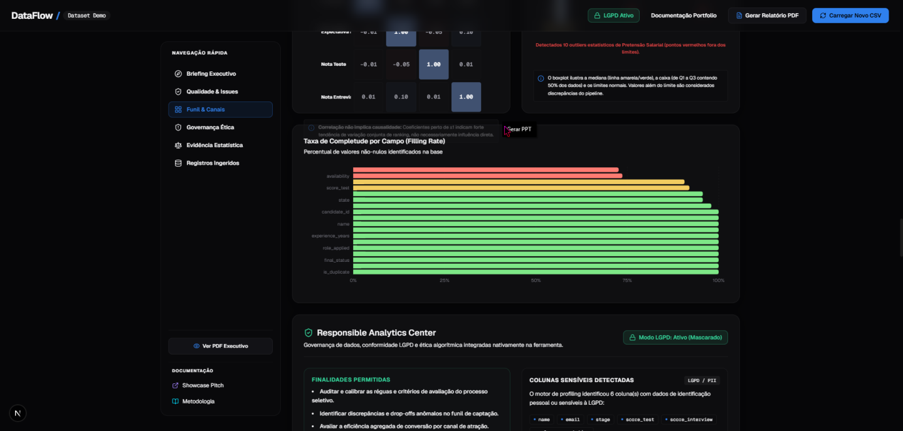
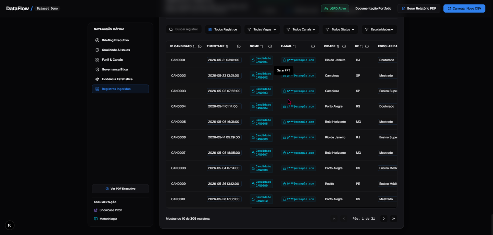
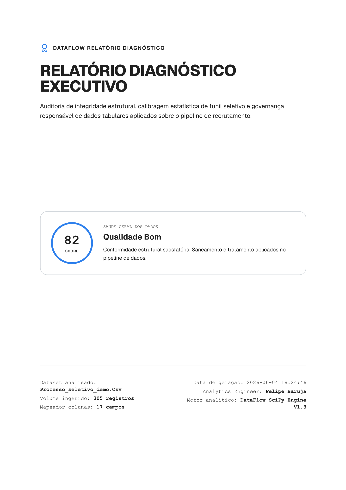
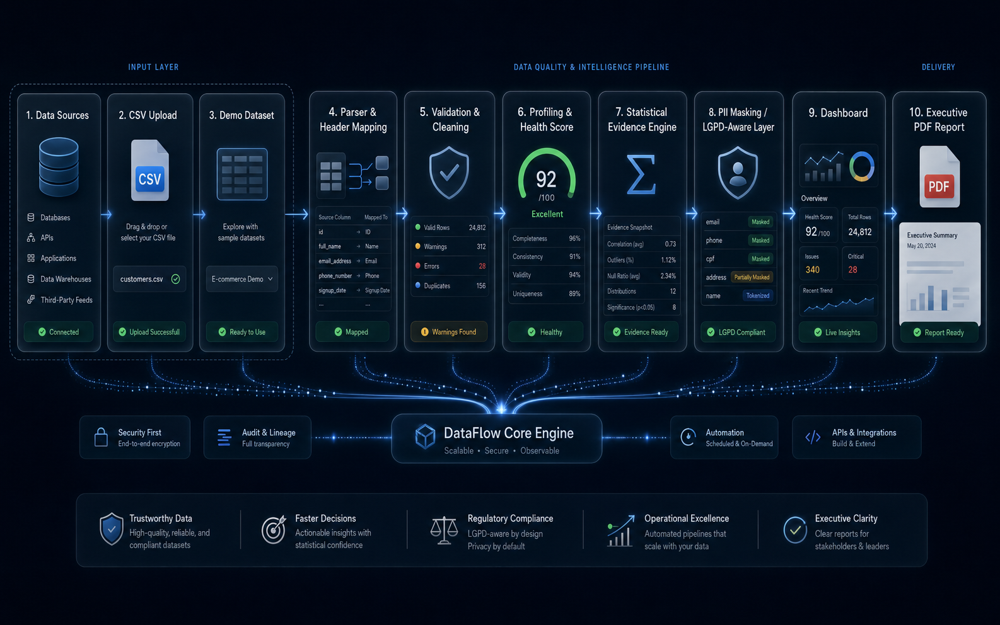

<div align="center">
  

  <h1>DataFlow</h1>

  <p><strong>Profiling, limpeza, evidência estatística e governança responsável para dados tabulares.</strong></p>
  <p><strong>Responsible data profiling, cleaning and statistical evidence for tabular datasets.</strong></p>

  <p>
    <a href="#-visão-geral--overview">PT-BR / English Overview</a> •
    <a href="#-product-preview">Preview</a> •
    <a href="#-screenshots">Screenshots</a> •
    <a href="#-stack--tecnologias">Stack</a> •
    <a href="#-arquitetura--architecture">Architecture</a> •
    <a href="#-quick-start--início-rápido">Quick Start</a> •
    <a href="#-autor--author">Author</a>
  </p>

  <p>
    
    
    
    
    
    
  </p>
</div>

<p align="center">
  
</p>

<p align="center">
  <a href="https://dataflow-sand.vercel.app/?demo=true"><strong>Live demo</strong></a> ·
  <a href="https://github.com/BarujaFe1/DataFlow/actions"><strong>CI</strong></a> ·
  <a href="./docs/GUIDED_DEMO.md"><strong>Demo guiada 3–5 min</strong></a> ·
  <a href="./docs/CHANGELOG_v1.4.md"><strong>Changelog v1.4</strong></a>
</p>

> **Estado honesto:** lab / portfolio product (não SaaS enterprise). Demo pública: frontend Vercel + API Render (cold start possível). Branch de qualidade: `chore/portfolio-quality-pass` — **merge em `main` necessário** para o deploy público refletir mascaramento na API e CI completa.

---

## Case demo — números verificados (não inventados)

| Métrica | Valor | Fonte |
|---------|-------|-------|
| Registros ingeridos | **305** | `data/seed/processo_seletivo_demo.csv` |
| Válidos após limpeza | **300** | KPI `valid_candidates` |
| Duplicatas | **5** | flag `is_duplicate` |
| Health Score | **82/100** | `-1` missing · `-2` dup · `-10` e-mail · `-5` outliers |
| Privacidade | `masked` | API mascara PII no JSON por padrão |

Snapshot versionado: [`data/demo_case_snapshot.json`](./data/demo_case_snapshot.json) (também alimenta o strip de métricas na landing — evita zeros quando a API está fria).

---

## 1. Visão Geral / Overview

O **DataFlow** é um produto de dados criado para transformar bases tabulares imperfeitas em um diagnóstico executivo confiável. 

Ele automatiza um fluxo completo de **ingestão, validação, limpeza, profiling, pontuação de qualidade, análise estatística, mascaramento de dados sensíveis e geração de relatório executivo**. Em vez de tratar arquivos CSV como planilhas isoladas, o DataFlow os converte em um pipeline analítico rastreável, com evidências, limitações e recomendações.

O projeto foi desenvolvido por **Felipe Alirio Baruja** como uma peça âncora de portfólio, combinando engenharia de software full-stack e ciência de dados aplicada à tomada de decisão de negócios.

> **Responsible Analytics Notice**  
> O DataFlow foi criado para diagnóstico agregado, auditoria de qualidade e análise de processo. Ele **não deve** ser usado para ranquear, aprovar, reprovar ou tomar decisões automatizadas sobre indivíduos.

---

## ✨ Product Preview

<p align="center">
  
</p>

O DataFlow apresenta um dashboard focado em diagnóstico executivo: Health Score, alertas controlados, LGPD ativo por padrão, recomendações acionáveis e navegação por seções analíticas.

---

## 2. Por que este projeto importa? / Why this project matters

* **Planilhas são a realidade:** A maioria dos processos de negócios consome dados tabulares imperfeitos. Saber higienizar, monitorar a completude e estruturar pipelines locais é uma habilidade fundamental.
* **Estatística sem contexto gera decisões ruins:** Além de descritivas, o DataFlow calcula testes exploratórios (Welch, χ², ANOVA) e documenta limitações; a narrativa de Bonferroni no frontend reduz falso positivo em storytelling.
* **Responsible Analytics (não “IA de seleção”):** O produto audita processo e qualidade — **nunca** ranqueia ou decide sobre indivíduos. PII é mascarado na API por padrão.
* **Produto além do notebook:** Substitui scripts estáticos por um fluxo interativo (upload → score → evidência → PDF) discutível em entrevista.

---

## 🧠 O diferencial do DataFlow / What makes DataFlow different

### Português
O DataFlow não é apenas um dashboard. Ele combina qualidade de dados, evidência estatística e governança responsável em uma experiência rastreável.

Ele mostra não apenas o que os dados indicam, mas também:
- quão confiável a base está;
- o que foi limpo ou sinalizado;
- quais problemas merecem ação;
- quais sinais estatísticos são exploratórios;
- onde a interpretação precisa ser limitada;
- como dados pessoais são protegidos.

### English
DataFlow is not just a dashboard. It combines data quality, statistical evidence and responsible analytics into one traceable experience.

It shows not only what the data says, but also:
- how reliable the dataset is;
- what was cleaned or flagged;
- which issues deserve action;
- which statistical signals are exploratory;
- where interpretation must be limited;
- how personal data is protected.

---

## 🎯 Problema que resolve / The problem it solves

Em fluxos reais de negócio, bases tabulares costumam chegar com problemas como:
- cabeçalhos inconsistentes e formatos desregulados;
- registros duplicados;
- e-mails inválidos;
- campos ausentes (nulos);
- valores discrepantes (outliers);
- datas e categorias em formatos diferentes;
- baixa rastreabilidade do que foi limpo ou alterado;
- relatórios que exibem números sem explicar incertezas estatísticas;
- risco de uso indevido de dados pessoais ou sensíveis.

O **DataFlow** cria uma camada organizada e auditável entre o dado bruto e a decisão analítica final.

---

## 🧩 Proposta / Analytical Pipeline

O DataFlow processa dados tabulares e entrega uma visão estruturada da qualidade da base, dos principais problemas, dos sinais estatísticos e dos limites de interpretação:

```txt
CSV Upload / Demo Dataset
  ↓
Parsing e mapeamento de colunas
  ↓
Validação de estrutura e tipos
  ↓
Limpeza, normalização e padronização
  ↓
Profiling de completude, duplicidade e outliers
  ↓
Health Score explicável
  ↓
Evidência estatística inferencial (SciPy)
  ↓
Mascaramento LGPD / PII
  ↓
Dashboard executivo & Relatório PDF de 9 Páginas
```

---

## 📸 Screenshots

<table>
  <tr>
    <td width="50%">
      
      <br />
      <sub><strong>Data Quality Cockpit</strong> — Health Score, missingness matrix, KPIs and explainable data quality.</sub>
    </td>
    <td width="50%">
      
      <br />
      <sub><strong>Quality Issues Register</strong> — prioritized issues with severity, impact and recommended action.</sub>
    </td>
  </tr>
  <tr>
    <td width="50%">
      
      <br />
      <sub><strong>Funnel & Channels</strong> — operational funnel, source efficiency, time series and score distribution.</sub>
    </td>
    <td width="50%">
      
      <br />
      <sub><strong>Statistical Evidence</strong> — p-values, effect sizes, Bonferroni-aware conclusions and responsible interpretation.</sub>
    </td>
  </tr>
  <tr>
    <td width="50%">
      
      <br />
      <sub><strong>Responsible Analytics</strong> — permitted uses, prohibited uses, sensitive columns and LGPD-aware governance.</sub>
    </td>
    <td width="50%">
      
      <br />
      <sub><strong>Records & Auditability</strong> — masked records, filters, exports and inspection-ready audit table.</sub>
    </td>
  </tr>
</table>

---

## 📄 Executive Report

<p align="center">
  
</p>

O relatório executivo consolida Health Score, KPIs, auditoria de limpeza, evidência estatística, Responsible Analytics, metodologia e dicionário de dados em um artefato pronto para apresentação.

---

## 📌 Estudo de Caso / Case Study

### 📌 Estudo de Caso: Pipeline Sintético de Recrutamento
O dataset demo simula um pipeline de recrutamento com 305 registros ingeridos, 300 registros válidos após limpeza e 17 colunas mapeadas. O DataFlow faz profiling da base, sinaliza e-mails inválidos, identifica duplicatas e outliers, aplica mascaramento de PII e calcula um Health Score explicável de **82/100**.

A camada estatística avalia sinais exploratórios usando testes de Welch, qui-quadrado, ANOVA, tamanhos de efeito e interpretação com correção de Bonferroni. Os resultados são apresentados como evidência de processo, nunca como decisão individual automatizada.

### 📌 Case Study: Synthetic Recruitment Pipeline
The demo dataset simulates a recruitment pipeline with 305 ingested records, 300 valid records after cleaning and 17 mapped columns. DataFlow profiles the dataset, flags invalid emails, identifies duplicates and outliers, applies PII masking and computes an explainable Health Score of **82/100**.

The statistical layer evaluates exploratory signals using Welch t-tests, chi-square tests, ANOVA, effect sizes and Bonferroni-aware interpretation. Results are presented as process-level evidence, never as automated individual decisions.

---

## 🧭 Visual Story / Jornada Analítica

A experiência do DataFlow foi pensada como uma jornada analítica guiada:
```txt
1. Importar CSV bruto ou carregar a base de demonstração (Processo Seletivo)
2. Analisar o Briefing Executivo inicial no cockpit
3. Avaliar as deduções de integridade no gráfico do Health Score
4. Investigar vulnerabilidades listadas no Quality Issues Register
5. Analisar o Funil Operacional SVG e eficiência de canais
6. Avaliar sinais e p-valores do Statistical Evidence Center
7. Conferir regras de Responsible Analytics (uso permitido / proibido — sem ranking individual)
8. Auditar ou exportar os registros mascarados na tabela de dados
9. Exportar o Relatório Executivo PDF de 9 páginas sem artefatos
```

---

## ⚙️ Funcionalidades Principais / Core Features

### Executive Data Briefing
Um painel inicial para leitura rápida do dataset: Health Score, volume ingerido, registros válidos, colunas mapeadas, status geral da base e badges de governança corporativa.

### Data Quality Score
Pontuação de qualidade de dados com cálculo explicável. O score parte de 100 e aplica penalizações proporcionais por nulos relevantes, duplicatas, formatos inválidos, outliers e colunas constantes.

### Quality Issues Register
Registro estruturado de inconsistências na base com severidade, tipo de falha, impacto analítico, ação de tratamento recomendada e status.

### Before/After Cleaning Audit
Grade comparativa mostrando o saneamento estrutural do pipeline local-first de limpeza de dados.

### LGPD / PII Masking
Privacidade e proteção de dados pessoais ativa por padrão no dashboard e nos arquivos exportados:
* **Nomes:** Exibidos como `Candidato CANXXXX`.
* **E-mails:** Mascarados como `g***@example.com`.

---

## 🛠️ Stack / Tecnologias

### Frontend
- **Framework:** Next.js 15 (App Router) & React 19
- **Linguagem:** TypeScript
- **Estilização:** Tailwind CSS v4
- **Componentização & Gráficos:** Recharts & Reative Custom SVG
- **Grade de Dados:** TanStack Table v8
- **Ícones:** Lucide Icons

### Backend
- **Framework API:** FastAPI & Uvicorn (Python 3.12)
- **Modelagem & Validação:** Pydantic v2
- **Processamento de Dados:** Pandas
- **Engine Analítica:** SciPy (Estatística Inferencial)
- **Suite de Testes:** Pytest

---

## 🧱 Arquitetura / Architecture

O projeto adota uma arquitetura monorepo simplificada e desacoplada:

```text
DataFlow/
├── apps/
│   ├── web/                         # Frontend Next.js (App Router)
│   │   ├── app/                     # Páginas (/demo, /showcase, /methodology)
│   │   ├── components/              # UI (charts, dashboard, report, table)
│   │   ├── lib/                     # API client, masking, insights helpers
│   │   └── types/                   # Definições estritas de tipos TypeScript
│   │
│   └── api/                         # Backend FastAPI
│       ├── app/
│       │   ├── api/                 # Endpoints REST (/analyze, /health, /demo)
│       │   ├── models/              # Schemas de validação Pydantic
│       │   └── services/            # Processadores (profiler, cleaner, inference)
│       └── tests/                   # Testes unitários do pipeline (pytest)
│
├── data/
│   └── seed/                        # Base de teste sintética (processo_seletivo_demo.csv)
│
├── docs/                            # Documentação técnica e de portfólio
├── assets/                          # Imagens, previews e ícones
├── start.bat                        # Inicializador integrado Windows
└── README.md                        # Esta documentação
```

---

## 🧱 Visual Architecture

<p align="center">
  
</p>

DataFlow follows a traceable analytical flow: raw CSV or demo dataset enters the pipeline, gets parsed, validated, cleaned, profiled, scored, interpreted and exported as dashboard insights or executive reports.

---

## 🔁 Data Flow Pipeline

```txt
Raw Input
  ↓
Encoding / Delimiter Parsing
  ↓
Header Mapping (Wizard Client-side)
  ↓
Schema Validation
  ↓
Cleaning & Normalization (Casing, Trim, Formats)
  ↓
Profiling & Outlier Detection (IQR limits)
  ↓
Quality Scoring (Health Score deductions)
  ↓
Statistical Evidence (Welch, ANOVA, Chi-Square in SciPy)
  ↓
Responsible Analytics Layer (PII Masking & Ethical Warnings)
  ↓
Dashboard Interface / PDF Report / CSV-JSON Export
```

---

## 🚀 Quick Start / Início Rápido

### Pré-requisitos
- **Node.js** v20 ou superior.
- **Python** v3.10 ou superior (preferencialmente Python 3.12).
- **Git**

### Opção 1 — Execução integrada no Windows
Na pasta raiz do projeto, dê dois cliques ou execute no console:
```bash
start.bat
```
Este script inicializa automaticamente o ambiente virtual Python (`.venv`), instala as dependências, inicia o backend FastAPI na porta `8000`, o frontend Next.js na porta `3000` e abre a aplicação no navegador padrão.

### Opção 2 — Execução manual

#### 1. Backend FastAPI (`apps/api`)
```bash
cd apps/api
python -m venv .venv
.venv\Scripts\activate            # Windows
source .venv/bin/activate          # Linux/macOS
pip install -r requirements.txt
uvicorn app.main:app --reload --port 8000
```
*API ativa em [http://127.0.0.1:8000](http://127.0.0.1:8000). Docs interativos em `/docs`.*

#### 2. Frontend Next.js (`apps/web`)
```bash
cd apps/web
npm install
npm run dev
```
*Frontend ativo em [http://localhost:3000](http://localhost:3000).*

---

## 🧪 Scripts e Testes / Scripts and Testing

### Rodar Testes de Backend (FastAPI/Pytest)
```bash
cd apps/api
.venv\Scripts\python -m pytest
```

### Validações de Frontend (Next.js)
```bash
cd apps/web
npm run lint         # Verificação de lint
npm run typecheck    # Verificação estrita de TypeScript
npm run build        # Compilação de produção
```

---

## 📊 Metodologia Estatística / Statistical Methodology

O DataFlow utiliza estatística inferencial clássica com foco em transparência e governança:
* **Welch t-test:** Usado para comparar médias de notas entre grupos aprovados vs demais (não assume homogeneidade de variâncias).
* **Qui-Quadrado ($\chi^2$):** Usado para testar dependência entre variáveis categóricas (como escolaridade vs status de aprovação).
* **ANOVA de Uma Via:** Analisa dispersão de notas técnicas entre múltiplos grupos.
* **Correção de Bonferroni:** Ajusta o nível de significância de testes simultâneos para mitigar o Erro Tipo I ($\alpha_{Bonferroni} = \alpha / m \approx 0.0083$ para 6 testes).
* **Dispersão & IQR:** Critério de Tukey ($Q3 + 1.5 \times IQR$) para isolar outliers numéricos de salário e experiência.
* **Correlação de Spearman:** Coeficiente ordinal client-side robusto a outliers numéricos.

---

## 🛡️ Segurança, LGPD e Boas Práticas

* **Mascaramento na API (padrão):** `name`, `email` e faixas de `salary_expectation` são mascarados em `services/masking.py` antes do JSON sair do servidor. O Network tab do navegador não expõe PII bruto no modo demo público.
* **Defesa em profundidade no client:** a UI reaplica máscaras e dicionário de colunas; export CSV/JSON respeita o modo privacidade.
* **Reveal controlado:** `privacy_mode=reveal` só funciona com `DATAFLOW_ALLOW_PII_REVEAL=true` (auditoria local). Nunca habilite em hosts públicos.
* **Responsible Analytics:** insights agregados; veto a ranking/decisão automatizada sobre indivíduos.
* Detalhes: [SECURITY_NOTES.md](./SECURITY_NOTES.md)

---

## 🧭 Roadmap do Produto

* **Fase 0 — Ingestão Local:** Parser CSV, Wizard de Schema e dashboard básico. ✅
* **Fase 1 — Profiling & Score:** Health Score + waterfall com breakdown da API. ✅
* **Fase 2 — Data Quality:** Issues Register e comparativo Before/After. ✅
* **Fase 3 — Estatística:** SciPy + narrativa Bonferroni no frontend. ✅
* **Fase 4 — UX Premium:** Funil, heatmap, boxplots, DataTable. ✅
* **Fase 5 — Relatório PDF:** Print stylesheet executivo. ✅
* **Próximas evoluções:** virtualização de tabelas, persistência opcional, XLSX, Playwright smoke, Bonferroni no backend.

---

## 💼 O que este projeto demonstra

- Pipeline de qualidade de dados explicável (não só um dashboard bonito)
- Health score auditável com penalidades documentadas
- Inferência estatística com limitações honestas
- LGPD-aware design (máscara na borda da API + UI)
- Full-stack TypeScript/Python com deploy Vercel + Render
- Documentação de portfólio e roteiro de entrevista

## 🎤 Como eu apresentaria em entrevista

1. **Problema (30s):** processos seletivos vivem em CSV bagunçado; decisões sem qualidade de dados e sem ética.
2. **Demo (90s):** `/?demo=true` → Health Score  → Issues Register → evidência estatística → PDF.
3. **Arquitetura (60s):** monorepo `apps/web` + `apps/api`; pipeline parse→map→clean→profile→aggregate→infer→mask.
4. **Trade-offs (45s):** score heurístico vs Great Expectations; Bonferroni no frontend; free-tier cold start.
5. **LGPD (30s):** mascaramento no payload; reveal só local; nunca ranking individual.
6. **Prova de engenharia (30s):** CI (lint/typecheck/pytest/build) + testes de masking e health score.

Roteiro expandido: [docs/portfolio_pitch.md](./docs/portfolio_pitch.md)

---

## 📚 Documentação Complementar

- [docs/ARCHITECTURE.md](./docs/ARCHITECTURE.md) — fluxo e limites do sistema
- [docs/TECHNICAL_DECISIONS.md](./docs/TECHNICAL_DECISIONS.md) — ADRs / trade-offs
- [docs/TESTING.md](./docs/TESTING.md) — como rodar testes
- [docs/DEPLOYMENT.md](./docs/DEPLOYMENT.md) — local, Vercel, Render
- [docs/AUDIT_REPORT.md](./docs/AUDIT_REPORT.md) — auditoria do quality pass
- [docs/HANDOFF.md](./docs/HANDOFF.md) — handoff da branch
- [docs/portfolio_pitch.md](./docs/portfolio_pitch.md) — pitch e LinkedIn
- [docs/technical_methodology.md](./docs/technical_methodology.md) — matemática
- [docs/final_release_audit.md](./docs/final_release_audit.md) — auditoria histórica

---

## 🖼️ GitHub Social Preview

Uma imagem para visualização social está disponível em:
```txt
assets/social-preview.png
```
*Dimensão recomendada: 1280x640, <1MB. Faça upload em: Repository Settings → Social Preview.*

---

## 🔖 GitHub Repository Metadata

### About sugerido
```txt
Responsible data profiling, cleaning, statistical evidence and LGPD-aware analytics for tabular datasets.
```

### Topics sugeridos
```txt
data-quality
analytics-engineering
data-profiling
statistics
fastapi
nextjs
typescript
python
scipy
responsible-analytics
lgpd
dashboard
portfolio-project
data-visualization
csv-processing
```

---

## ✅ Status atual

- **Lab / portfolio product** — demo pública em Vercel + API Render
- Branch de qualidade: `chore/portfolio-quality-pass`
- Licença: MIT (`LICENSE`)
- CI: `.github/workflows/ci.yml` (API pytest + web lint/typecheck/build)

---

## 👤 Autor / Author

Desenvolvido por **Felipe Alirio Baruja**.

- **Portfolio:** [barujafe.vercel.app](https://barujafe.vercel.app/)
- **GitHub:** [@BarujaFe1](https://github.com/BarujaFe1)
- **LinkedIn:** [Felipe Alirio Baruja](https://www.linkedin.com/in/barujafe/)

---

## 📄 Licença / License

MIT License — veja [LICENSE](./LICENSE). Copyright (c) 2026 Felipe Alirio Baruja.
