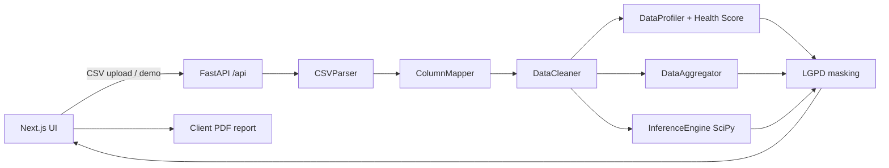

# DataFlow — Architecture

## Overview

DataFlow is a simplified monorepo for **tabular recruiting data quality**:

```
DataFlow/
├── apps/web/     # Next.js 15 App Router (dashboard, report, methodology)
├── apps/api/     # FastAPI analytics pipeline
├── data/seed/    # Synthetic demo CSV + generator
├── docs/         # Architecture, methodology, handoff
└── assets/       # Screenshots for portfolio README
```

There is no npm/pnpm workspace root — each app is independent.

## Request flow



## Domain boundaries

| Layer | Responsibility |
|-------|----------------|
| `services/parser.py` | Encoding/delimiter sniff, row extraction |
| `services/mapper.py` | PT/EN header aliases → canonical schema |
| `services/cleaner.py` | Normalize categories, dates, floats, duplicates |
| `services/profiler.py` | Column profiles, IQR outliers, **health score + breakdown** |
| `services/aggregator.py` | KPIs, funnel, sources, insights |
| `services/inference.py` | χ², Welch t, ANOVA (exploratory) |
| `services/masking.py` | PII masking before JSON response |
| `apps/web/lib/masking.ts` | Defense-in-depth UI masking + dictionary |
| `apps/web/lib/analytics/*` | Executive conclusions / Bonferroni (UI narrative) |

## Canonical schema

Keys used after mapping (UI table headers must use these, not raw CSV names):

`candidate_id`, `timestamp`, `name`, `email`, `city`, `state`, `education_level`, `experience_years`, `source_channel`, `role_applied`, `stage`, `score_test`, `score_interview`, `final_status`, `salary_expectation`, `availability`, `remote_preference`, `is_duplicate`.

## Privacy model

1. Profiling/aggregation/inference run on **cleaned unmasked** data in-process.
2. HTTP `records` payload is **masked by default** (`privacy_mode=masked`).
3. `privacy_mode=reveal` only works when `DATAFLOW_ALLOW_PII_REVEAL=true` (local audit).
4. UI privacy toggle is defense-in-depth + education; public demos should keep API masked.

## Deploy topology

- **Web:** Vercel (`apps/web`) → `NEXT_PUBLIC_API_URL`
- **API:** Render free tier (`apps/api`) + GitHub Action keep-warm
- **No database** — ephemeral analysis; demo CSV on disk

## Non-goals (V1)

- Auth / multi-tenant storage
- Automated hiring decisions
- Real PII production datastore
- Streaming / CDC pipelines
